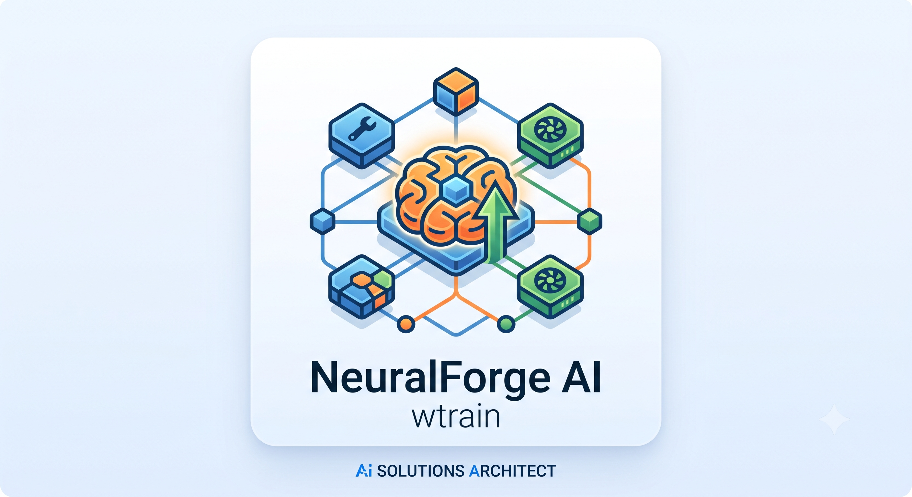

# NeuralForge Extension

This is the official VSCode Extension for the **train_service2** ecosystem. It integrates tightly with the NeuralForgeAI cluster through the local MCP Server, allowing you to monitor distributed ML workers, generate configuration YAMLs, and download trial artifacts directly from VSCode.

## Features

- **Cluster TreeView**: Monitor the active managers, invokers, and the current tasks queue.
- **Training Config Wizard**: An interactive webview to automatically generate NeuralForge-compatible `training.yaml` files.
- **Trial Artifacts Downloader**: Download and package all trial output files (EDA, models, reports) into a local `.zip` file from the MLflow Tracking Server.

## Architecture

This extension works as an MCP Client and depends on `wyoloservice2_mcp` running locally.

## License

This project follows the dual-licensing structure of the **train_service2** ecosystem:
- Open Source: AGPLv3
- Commercial: See `COMMERCIAL.md`
